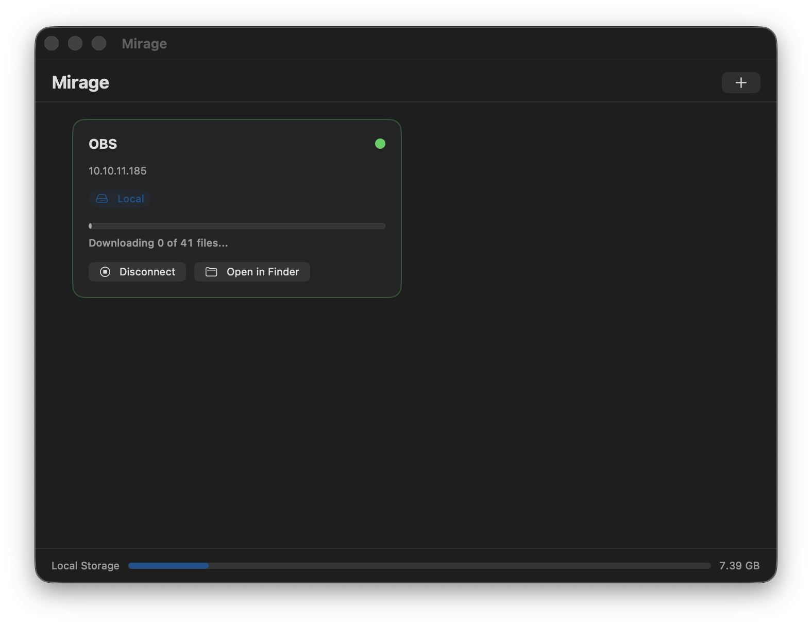

# Mirage

Mount SMB network shares as local Finder volumes with smart caching and offline file support.

## Screenshot



## Features

- **One-click mounting** — connect to any SMB share as a local volume in Finder
- **Smart caching** — files are cached locally as you access them; configurable cache size
- **Keep on this Mac** — download an entire share for offline access, like iCloud's "Keep Downloaded"
- **Offline protection** — mark individual files or folders so they're never evicted from cache
- **Drag-and-drop setup** — drag a file from an existing Finder SMB connection to auto-configure a new share
- **Per-share sync modes** — stream (access-as-needed) or keep-local (full offline copy)
- **Menu bar control** — quick connect/disconnect from the menu bar icon
- **Auto-updates** — built-in updater checks for new versions automatically (via Sparkle)

## Requirements

- macOS 14.0 (Sonoma) or later
- Apple Silicon or Intel Mac
- rclone installed (the app will offer to install it automatically on first launch)

## Installation

1. Download `Mirage-v1.0.0-aarch64.zip` from the [Releases](../../releases) page
2. Extract the zip and move `Mirage.app` to your Applications folder
3. Double-click to open — macOS will block it the first time
4. Go to **System Settings → Privacy & Security** and click **Open Anyway**
5. Mirage will open normally from that point on

## Usage

1. Click **+** or drag a file from a Finder SMB connection into the app window
2. Enter your server address, share name, username, and password
3. Click **Connect** — the share appears in Finder as a local volume
4. To work offline, click **Keep on this Mac** to download everything to your local cache

## Configuration

All settings are in **Mirage → Settings**:

| Setting | Description |
|---------|-------------|
| rclone path | Path to rclone binary (auto-detected) |
| Max cache size | Global disk limit for all cached shares (default: 50 GB) |
| Auto-connect on launch | Mount all shares when the app opens |

Per-share settings (in the share's detail view):

| Setting | Description |
|---------|-------------|
| Cache mode | off / minimal / writes / full |
| Cache max age | How long files stay cached before rclone re-checks |
| Write-back delay | How long before modified files are uploaded |
| Custom cache location | Override to an external drive |

## Building from Source

```bash
git clone https://github.com/NorthwoodsCommunityChurch/avl-mirage.git
cd avl-mirage/Mirage
xcodegen           # generates Mirage.xcodeproj from project.yml
open Mirage.xcodeproj
```

Build and run with **⌘R** in Xcode, or use the release build script (see `App Updates/sparkle-build-template.sh`).

rclone must be installed separately: `brew install rclone`

## Project Structure

```
Mirage/
├── Mirage/
│   ├── App/                  # Entry point, AppState coordinator, AppDelegate
│   ├── Models/               # SMBShareConfig, MountStatus, VFSCacheMode
│   ├── Services/             # RcloneProcessManager, CacheManager, CacheWarmer,
│   │                         #   KeychainHelper, RcloneInstaller, StatusMonitor
│   ├── Utilities/            # Process async wrapper, byte formatting, extensions
│   ├── Views/                # All SwiftUI views
│   └── Resources/            # Info.plist, entitlements, app icons
├── MirageTests/              # XCTest unit tests (command builder, paths)
└── project.yml               # XcodeGen project configuration
```

## License

MIT — see [LICENSE](LICENSE)

## Credits

See [CREDITS.md](CREDITS.md)
